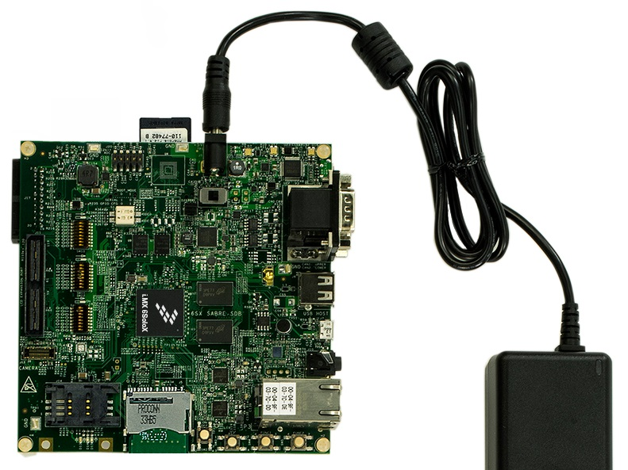

Power-On
========

i.MX6 SoloX SabreSD takes the power from the *J1* connector. The board is shipped with an external power adapter.

To power-on the board, connect the power supply to *J1* and toggle *SW1-PWRON* switch.
